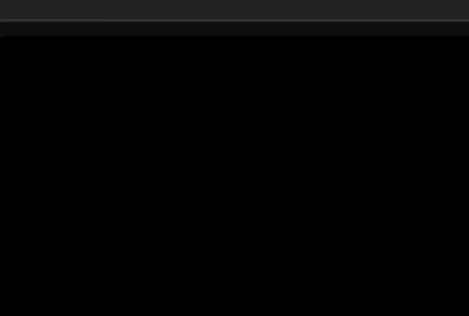

# SyntaxDB Atom Plugin

An atom package that provides a simple interface to search and view the [SyntaxDB](https://syntaxdb.com/) database.

# Installation
Either clone this repo into your packages directory or download it from the atom packages repository.

# How to Use
To use the atom package, make sure it's installed, then press Ctrl-Alt-S to activate the SyntaxDB search panel.
To activate the language filter, which displays all concepts on the SyntaxDB database by language, press Ctrl-Alt-L.

On the search panel, type in a search query (eg. "for loop in Java") and press enter. A list view will then appear, displaying the results
it has gathered from the SyntaxDB API. Selecting any of these results will bring up a results view for the entry, displaying
its syntax as well as additional information.

It is also possible to place the syntax example provided by SyntaxDB directly into your document. To do this, make sure the Example tab
is currently selected, then press the "Place in Document" button. (or press shift-enter)

# Issues
- Pressing enter more than one on search will do multiple search requests. [#1](https://github.com/Coteh/syntaxdb-atom-plugin/issues/1)
- Previous tab shortcut registers twice if not released immediately. [#2](https://github.com/Coteh/syntaxdb-atom-plugin/issues/2)

# Future Additions
- Finish spec tests
- Improve package activation time
- Convert to CoffeeScript
- Save common results to cache (via View serialization or some other method)
